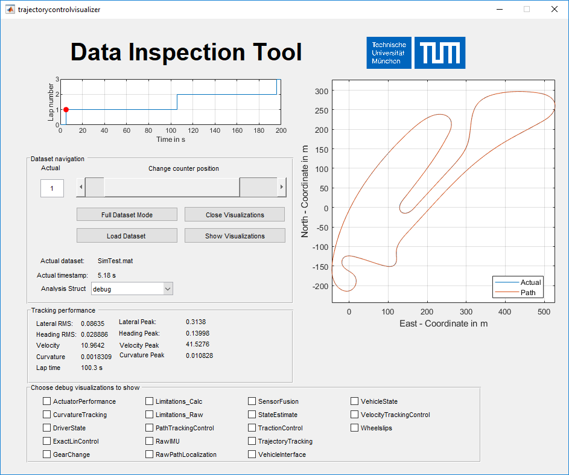
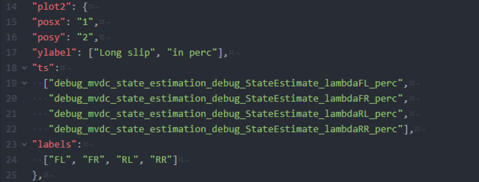
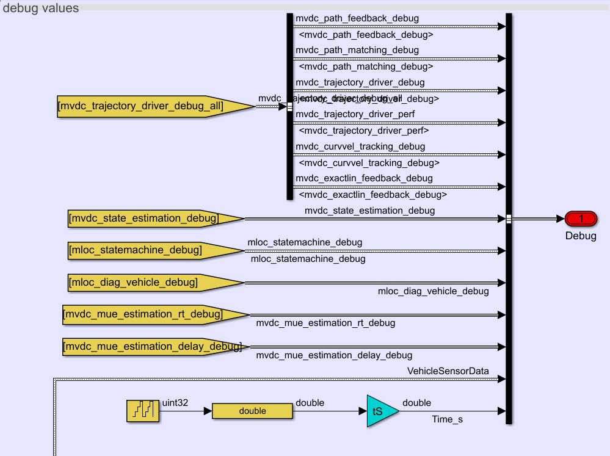

### Data Inspection Tool
To faciliate an easy and convenient debugging workflow, a GUI to visualize the relevant data was developed. It is used for all data concerning algorithms running on the motion control unit. This includes low level startup and safety logic, low level vehicle interfaces, the final sensor fusion and control algorithms. The tool is based on a common data format for all measurement data, independently if they are created by the simulation or the real vehicles. To enable this, there are scripts to convert the data from the vehicle or the simulation to the necessary format and store it as .mat files.

The tool allows to display either the full file data or separate it based on laps (indicated on the left top corner). The navigation can be done via the slider below. On the right side the global track is shown (target path and actual path). Below some key performance indicators are displayed. The checkboxes at the bottom can be used to select which detail plots are displayed when clicking on "Show visualization".

### Workflow
* Get the logs and convert them according to the steps given in the vehicle specific documentation
* Open the Simulink project of your vehicle or mod_vehicle_dynamics_control
* Run `trajectorycontrolvisualizer` from the command line
* Choose `debug` from the drop-down menu `Analysis Struct` and select your debug config folder. An example can be found in `/scripts/ControlVisualizer/Config1` Each .json file in this folder leads to one analysis plot. They are now depicted in the bottom of the main GUI as checkboxes.
* Press `Load Dataset` and choose the dataset you want to analyze. Depending on the size of the log file, this might take some time.
* You have two options to analyze the data. Either lap based or the complete dataset. After loading the dataset, the config is in Single Lap Mode. This means that you can use the slider to navigate through the dataset. Note that the overview plot on the right always displays the corresponding time frame. If you want to display the complete dataset, click on Full Dataset Mode. This disables the slider and sets the timeframe to the complete dataset.
* Tick the checkboxes at the bottom for the detail plots you want to see (multiple are possible).
* Press `Show Visualizations` and wait until all the plots are displayed
* If you want to close all plots at the same time, press `Close Visualizations`

### Add custom visualization configs
While the standard config might cover many cases, you might want to create your own figures and put them together in
your own way. To do this, follow this workflow:
* Create a new folder with a meaningful names
* Place all .json files for your plots in there
* Open it after starting the GUI

The design of new plots is a little bit more involved. In general, each .json file represents one figure. The filename is used as figure title and checkbox name. The file itself, is a collection of multiple plot definitions. A single plot definition looks as follows:

The name **plot2** is not used in the programm. **posx** and **posy** specify the subplot position in the figure. **posx** represents the column and **posy** the row in a grid. They start with 1 and can be arbitrary high. Experience has shown that single column figures are handy during analysis, furthermore it is advised to not go for more than three rows. They become hard to read on a laptop screen during track operation. **ylabel** represents the label of the y-axis. The multiple strings allow to put a multi-line label. The **ts** structure holds the variable names of the timeseries stored in the *debug* structure located in the log file. These must match exactly, otherwise the plot cannot be drawn. Finally, the **labels** structure holds the legend entries for each of the timeseries. They are matched in order of their appearance. Each timeseries must have a label.

In general, it is best to start from an existing .json file and to modify it according to your needs. This will help you to gain the necessary insight and create your own debug plots fastly.

### Add new debug signals
In general, all signals are available which can be found in the debug structure in the log files. It is created from the debug bus in the software. You find it in the main model `mvdc_vehicle_dynamics_control.slx`. If you need additional signals, please add them to the available busses or add a new debug bus in case you have a
new software module. Adding other signals than the debug structure is in general possible, but the workflow for this
bus is automated (including generation of logging models etc.).

